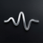

<p align="center">
  
</p>

<h1 align="center">ScreenSense Voice</h1>

<p align="center">
  <strong>Talk to your screen. Get instant answers.</strong><br/>
  A voice-first AI Chrome extension that sees your screen and answers your questions — by voice, text, or both.
</p>

<p align="center">
  
  
  
  
</p>

---

## The Problem

Every day, millions of people stare at their screens trying to understand something — an error message, a complex UI, a dense paragraph, a piece of code. The workflow is always the same: **copy text, switch tabs, paste into ChatGPT, read the answer, switch back.** Context is lost. Flow is broken. Time is wasted.

For people with visual impairments or reading difficulties, the problem is even worse — most AI tools are text-first and inaccessible.

## The Solution

**ScreenSense Voice** eliminates the friction entirely. Hold a key, speak your question, and get an AI-powered answer overlaid directly on the page you're looking at. No tab switching. No copy-pasting. No lost context.

The AI **sees your screen** (captures a screenshot at the moment you ask) and **hears your voice** (real-time transcription), then responds with a streaming text overlay and a short spoken summary. It's like having a knowledgeable friend looking over your shoulder, ready to explain anything in 3 seconds.

---

## Demo

https://github.com/user-attachments/assets/demo-placeholder

> Hold **`** (backtick) on any webpage, ask a question about what you see, release the key, and get an instant AI-powered answer with voice and text.

---

## Features

### Voice-First Interaction
- **Hold-to-talk**: Press and hold a configurable shortcut key (default: backtick `` ` ``) to start recording
- **Real-time waveform**: Animated visualization follows your cursor while recording
- **Whisper transcription**: Powered by Groq's Whisper Large V3 Turbo for fast, accurate speech-to-text

### Screen-Aware AI
- **Screenshot capture**: Automatically captures what's on your screen when you ask
- **Vision model**: Uses Llama 4 Scout with vision capabilities to understand screenshots
- **Streaming responses**: Text streams in real-time, word by word
- **Conversation memory**: Up to 20 turns of follow-up questions per tab with full context

### Smart Audio Summaries
- **TTS summaries**: Instead of reading the full response verbatim, the AI generates a concise ~3 second spoken summary of the key takeaway
- **ElevenLabs voice**: Natural-sounding voice via ElevenLabs API (Rachel voice)
- **Browser fallback**: Falls back to Web Speech API if no ElevenLabs key is configured

### Display Modes
| Mode | Text Overlay | Audio |
|------|:-----------:|:-----:|
| **Both** (default) | Full streaming text | Short spoken summary |
| **Audio Only** | Animated waveform | Short spoken summary, auto-dismisses |
| **Text Only** | Full streaming text | Silent |

### Explanation Levels
Tailor AI responses to your understanding level:

| Level | Style |
|-------|-------|
| **Kid** | Simple words, fun comparisons, like explaining to a 5-year-old |
| **Student** | Clear language, relatable examples, high school level |
| **College** | Technical terms when needed, accessible explanations |
| **PhD** | Precise terminology, deep domain knowledge assumed |
| **Executive** | Concise, impact-focused, trade-offs and strategic implications |

### Overlay UI
- **Shadow DOM isolation**: Styles never leak to or from the host page
- **Smart positioning**: Follows cursor during loading, locks when content streams in, edge-aware placement
- **Follow-up input**: Type follow-up questions directly in the overlay
- **Context bar**: Shows conversation progress, TTS toggle, and clear button
- **Escape to dismiss**: Clean keyboard-driven UX

---

## Architecture

```
┌─────────────────────────────────────────────────────────────┐
│                     Content Script (Tab)                     │
│  ┌──────────────┐  ┌──────────────┐  ┌───────────────────┐  │
│  │   Shortcut    │  │  Listening   │  │     Overlay       │  │
│  │   Handler     │  │  Indicator   │  │  (Shadow DOM)     │  │
│  └──────┬───────┘  └──────────────┘  └───────────────────┘  │
│         │                                                    │
└─────────┼────────────────────────────────────────────────────┘
          │ chrome.runtime.sendMessage
          ▼
┌─────────────────────────────────────────────────────────────┐
│                  Service Worker (Background)                  │
│  ┌──────────────┐  ┌──────────────┐  ┌───────────────────┐  │
│  │  Screenshot   │  │  Groq STT   │  │   Groq Vision     │  │
│  │  Capture      │  │  (Whisper)  │  │   (Llama 4)       │  │
│  └──────────────┘  └──────────────┘  └───────────────────┘  │
│                          │                                    │
│  ┌──────────────┐  ┌─────▼────────┐  ┌───────────────────┐  │
│  │ Conversation  │  │  TTS Summary │  │   Settings/       │  │
│  │ History       │  │  Generator   │  │   Storage         │  │
│  └──────────────┘  └──────────────┘  └───────────────────┘  │
└─────────┬────────────────────────────────────────────────────┘
          │ chrome.runtime.sendMessage
          ▼
┌─────────────────────────────────────────────────────────────┐
│              Offscreen Document (Microphone)                  │
│  ┌──────────────┐  ┌──────────────┐                          │
│  │ MediaRecorder │  │  Amplitude   │                          │
│  │ (Audio)       │  │  Analyzer    │                          │
│  └──────────────┘  └──────────────┘                          │
└─────────────────────────────────────────────────────────────┘
```

### Data Flow
1. **User holds shortcut key** → Content script dispatches event → Service worker starts offscreen recording
2. **User speaks** → Offscreen captures audio + sends amplitude data for live waveform
3. **User releases key** → Offscreen sends base64 audio → Service worker runs pipeline:
   - **Stage 1**: Capture screenshot via `chrome.tabs.captureVisibleTab`
   - **Stage 2**: Transcribe audio via Groq Whisper API
   - **Stage 3**: Stream response via Groq Vision API (screenshot + transcript + history)
   - **Stage 4**: Generate TTS summary (fire-and-forget, non-blocking)
4. **Content script** receives streamed chunks → Overlay renders markdown in real-time
5. **TTS summary** arrives → Speaks via ElevenLabs or Web Speech API

---

## Tech Stack

| Component | Technology |
|-----------|-----------|
| **Extension** | Chrome Manifest V3, TypeScript |
| **Speech-to-Text** | Groq Whisper API (`whisper-large-v3-turbo`) |
| **Vision + AI** | Groq Chat API (`meta-llama/llama-4-scout-17b-16e-instruct`) |
| **Text-to-Speech** | ElevenLabs API (`eleven_flash_v2_5`) + Web Speech API fallback |
| **Audio Recording** | MediaRecorder API + AudioContext (AnalyserNode for waveform) |
| **UI Isolation** | Shadow DOM (closed mode) |
| **Settings UI** | React 18 |
| **Build** | Webpack 5, TypeScript, PostCSS |
| **Landing Page** | Vanilla HTML/CSS/JS with canvas particle animation |

---

## Getting Started

### Prerequisites
- **Node.js** 18+ and **npm**
- **Google Chrome** (or any Chromium-based browser)
- **Groq API Key** (free) — [Get one here](https://console.groq.com/keys)
- **ElevenLabs API Key** (optional, for natural voice) — [Get one here](https://elevenlabs.io/app/settings/api-keys)

### Installation

```bash
# 1. Clone the repository
git clone https://github.com/anirxdh/ScreenSense.git
cd ScreenSense

# 2. Install dependencies
npm install

# 3. Build the extension
npm run build
```

### Load into Chrome

1. Open `chrome://extensions/` in your browser
2. Enable **Developer mode** (toggle in top right)
3. Click **Load unpacked**
4. Select the `dist/` folder from this project
5. The ScreenSense icon appears in your toolbar

### Configure

1. Click the ScreenSense extension icon → **Settings**
2. Enter your **Groq API Key** (required)
3. Optionally enter your **ElevenLabs API Key** (for natural voice)
4. Choose your **Display Mode** and **Explanation Level**
5. Click **Save Changes**

### Usage

1. Navigate to any webpage
2. **Hold the backtick key** (`` ` ``) — you'll see a waveform appear
3. **Speak your question** while holding the key
4. **Release the key** — the AI overlay appears with your answer
5. **Type follow-ups** in the overlay input, or **hold the key again** to ask a new voice question
6. Press **Escape** to dismiss the overlay

---

## Project Structure

```
ScreenSense/
├── src/
│   ├── background/
│   │   ├── service-worker.ts      # Main orchestrator & pipeline
│   │   ├── screenshot.ts          # Tab screenshot capture
│   │   └── api/
│   │       ├── groq-stt.ts        # Whisper transcription
│   │       └── groq-vision.ts     # Vision streaming + TTS summary
│   ├── content/
│   │   ├── content-script.ts      # Entry point, message routing
│   │   ├── shortcut-handler.ts    # Hold-to-talk keyboard handler
│   │   ├── listening-indicator.ts # Animated waveform component
│   │   ├── overlay.ts             # Response overlay (Shadow DOM)
│   │   ├── tts.ts                 # Text-to-speech module
│   │   ├── markdown.ts            # Lightweight markdown renderer
│   │   └── content.css            # Base styles
│   ├── offscreen/
│   │   └── offscreen.ts           # Microphone recording + amplitude
│   ├── settings/
│   │   ├── Settings.tsx           # React settings page
│   │   ├── settings.html          # Settings page shell
│   │   └── settings-entry.tsx     # React entry point
│   ├── shared/
│   │   ├── types.ts               # TypeScript interfaces
│   │   ├── constants.ts           # Default settings & storage keys
│   │   └── storage.ts             # Chrome storage helpers
│   ├── popup/                     # Extension popup
│   └── welcome/                   # First-run onboarding
├── landing/                       # Landing page (standalone)
│   ├── index.html                 # Full landing page
│   ├── logo.png                   # Icon
│   └── logo-full.png              # Full logo
├── public/
│   └── icons/                     # Extension icons (16, 48, 128px)
├── manifest.json                  # Chrome extension manifest (MV3)
├── webpack.config.js              # Build configuration
├── tsconfig.json                  # TypeScript configuration
└── package.json
```

---

## Development

```bash
# Watch mode — rebuilds on file changes
npm run dev

# Production build
npm run build
```

After rebuilding, go to `chrome://extensions/` and click the **reload** button on the ScreenSense card to pick up changes.

---

## How It's Different

| Feature | ChatGPT / Copilot | ScreenSense Voice |
|---------|:-----------------:|:----------------:|
| Voice input | Requires separate app | Built-in hold-to-talk |
| Screen context | Must copy/paste or describe | Automatic screenshot |
| Response delivery | Separate tab/window | Inline overlay on current page |
| Audio response | Full text readback | Smart 3-second summary |
| Explanation levels | One-size-fits-all | 5 levels (Kid → Executive) |
| Context switching | Required | Zero |
| Works on any page | No | Yes |

---

## Privacy & Security

- **No data stored remotely** — all conversation history is in-memory (per tab) and cleared when the tab closes
- **API keys stored locally** — saved in `chrome.storage.local`, never transmitted to any server besides the API providers
- **Shadow DOM isolation** — overlay styles are completely isolated from host pages, preventing CSS injection
- **HTML sanitization** — AI responses are sanitized before rendering to prevent XSS
- **Microphone access** — only active while you hold the shortcut key; recording stops immediately on release

---

## API Usage & Costs

| API | Free Tier | Used For |
|-----|-----------|----------|
| **Groq** | 30 RPM, 14,400 RPD | Speech-to-text + Vision AI + TTS summaries |
| **ElevenLabs** | 10,000 chars/month | Natural voice (optional) |

ScreenSense works entirely on **free tiers** — no credit card required.

---

## Built At

**[TreeLine Hacks 2026](https://treelinehacks.com)** — A 36-hour hackathon challenging participants to tackle real-world problems with no preset themes. ScreenSense was conceived, designed, and built from scratch during the event.

---

## Team

Built with caffeine and conviction by our team at TreeLine Hacks 2026.

---

## License

MIT License — see [LICENSE](LICENSE) for details.

---

<p align="center">
  
  <br/>
  <sub>ScreenSense Voice — because your screen should be able to hear you.</sub>
</p>
